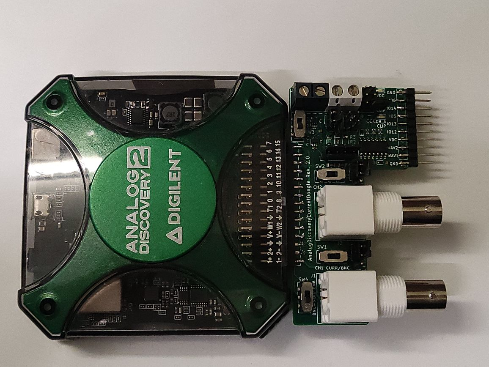

# CurrentDongle attachment for the `Analog Discovery 2`

I actually use this simple board all the time, so decided to share it with the world.

It was made for these reasons:
* Simplifying current consumption measurement process, using AD2 bulit-in programmable voltage source, and dual INA186 amplifiers (for extended dynamic range)
* Breaking out BNC connectors, because, for some reason, such breakout board from Analog costs an ARM and a leg.
* Just breakout board for hacking stuff together

There's an simple bulit-in comparator circuit that blinks a LED when the channel range is reached. The high-accuracy channel usually also blinks when the DUT performs some action, which is also an useful feedback I guess.

In `scripts` folder, there's an example `digilent waveforms` script that I use for current measurement. Some things to note:
* programmable voltage sources on `AD2` are noisy as hell when the current is under a couple of milliamps - hence the resistor in this area.
* the voltage offset errors from `INA186`s can be easilly callibrated out, using the provided script.

What this device is NOT:
* Crosstalk-free oscilloscope adapter
* Super accurate, self calibrating current probe
* Lab-ready device

Stuff to improve:
* The LEDs will not work when system is powered by 1.8V - but it's not fixable easily.

## Some pics:

PCB connected to the Analog Discovery 2

PCB render

PCB IRL

